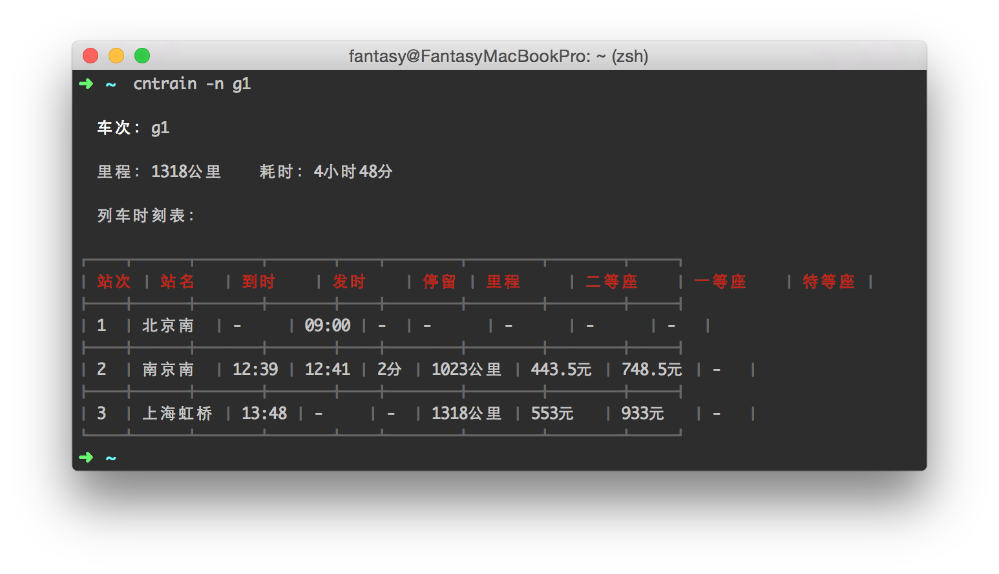
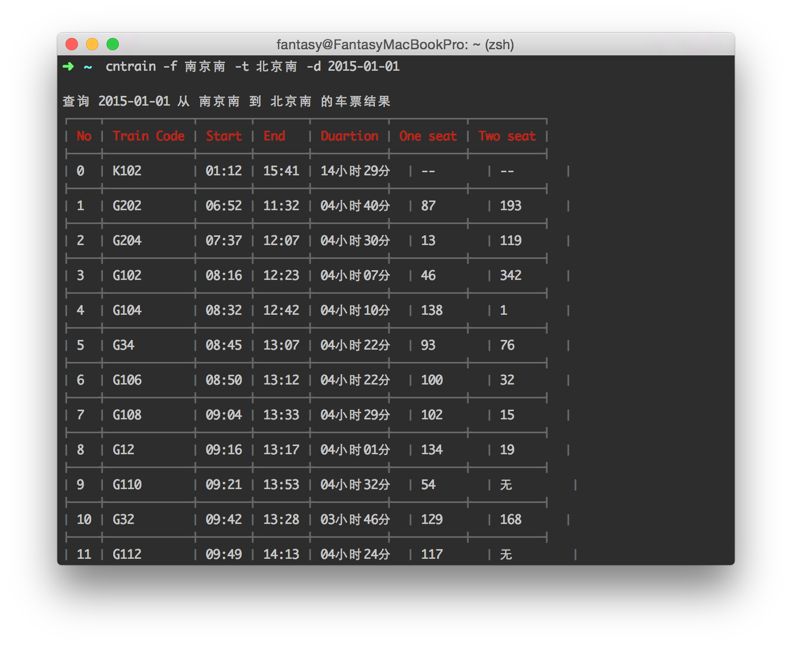

node-train
---

[![NPM version][npm-image]][npm-url]
[![David deps][david-image]][david-url]

[npm-image]: https://img.shields.io/npm/v/cntrain.svg?style=flat
[npm-url]: https://npmjs.org/package/cntrain
[david-image]: https://img.shields.io/david/SFantasy/node-train.svg?style=flat
[david-url]: https://david-dm.org/SFantasy/node-train

[](https://nodei.co/npm/cntrain/)

Sample Node.js CLI project using [node-chepiao-sdk](https://github.com/SFantasy/node-chepiao-sdk)

> **NOTE**: The API key maybe outdated when you using it

## Install

```
[sudo] npm install cntrain [-g]
```

## Usage

- Query train schedule

```sh
cntrain -n g1
```

- Query left tickets

```sh
cntrain -f 南京南 -t 北京南 -d 2015-01-05
```

- Look for help

```sh
cntrain -h
```

- Get the vertion

```sh
cntrain -V
```

## Screenshot

- Query train schedule



- Query left tickets



## License

The MIT License
